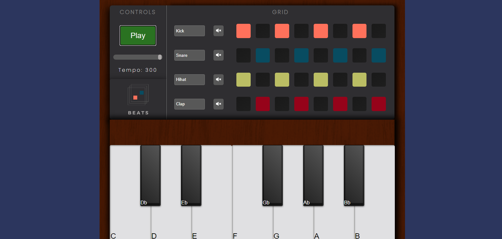

# BeatPiano

My previous project (BeatMaker) plus piano. Made using HTML, CSS and vanilla JS. The piano can be played with the keyboard using z, x, c, v, b, n, m, s, d, g, h, j. Also, I have made a different layout and a logo for the project.ect. 

